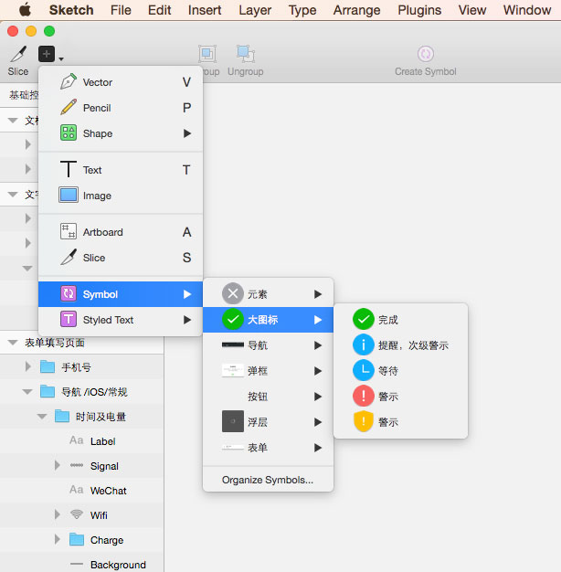

### 简介

[WeUI](https://github.com/weui/weui) 是一套由微信官方设计团队为微信 Web 开发量身设计的，同微信原生视觉体验一致的基础样式库。

WeUI-Sketch 是微信官方设计团队设计的 WeUI 全部组件的视觉标准。开发者或设计师可以使用 WeUI-Sketch 进行微信 Web 开发的原型设计、视觉设计等。

### 环境依赖

#### Sketch 版本

不低于 v3.6

#### 字体

- 苹方/ PingFang SC 
- SF UI Text
- 思源黑体  / Noto Sans CJK
- Robot

### 使用说明

#### 方法一

复制粘贴控件图层进行创作

#### 方法二

使用Symbol进行快速创作，可方便的在多个页面和画板中重复运用控件

### 使用须知

WeUI-Sketch 是微信官方设计团队作品，知识产权等相关权利归腾讯公司所有。使用前，请阅读以下使用须知及法律声明。对于违反使用须知及法律声明的行为，我们将保留法律追究权利。

#### 我们鼓励
- 使用 WeUI-Sketch 的控件，进行适当地再次加工创作，形成自己的作品

#### 我们禁止
- 未经允许直接利用 WeUI-Sketch 作品开展牟利行为，包括但不限于打包售卖、另行建立镜像收取费用、有偿下载、积分下载等行为

### 法律声明

1. 腾讯公司是本帐号及其下项目的知识产权权利人。

2. 本帐号下所有项目及相关所有信息的一切著作权、商标权、专利权、商业秘密等知识产权（包括但不限于文字、图片、音频、视频、图表、界面设计、版面框架、有关数据或电子文档等）均受中华人民共和国法律法规和相应的国际条约保护，腾讯享有上述知识产权，但相关权利人依照法律规定应享有的权利除外。

3. 未经腾讯或相关权利人书面同意，你不得以直接盈利为目的自行或许可任何第三方直接售卖本帐号下项目数据，或者建立收费镜像下载本帐号下项目数据等。

4. 腾讯公司欢迎其它方式的使用，包括在本帐号下项目的基础上进行再加工、衍生、演绎，形成其它作品或将其作为作品的元素。

### Notice

1. Tencent is the owner of all Intellectual property rights of this account and all projects posted under this account.

2. All intellectual property rights, including but not limited to copyright, trademark, patent, trade secret , of all projects and all relevant information (including, but not limited to text, image, audio, video, graphics, interface design, layout framework, relevant data or electronic documents and etc.) posted under this account are governed and protected by laws and regulations of P.R.China and applicable international treaties, Tencent has all the intellectual property aforesaid, except for those rights that owned by any third party in accordance with applicable laws. 

3. Without written consent of Tencent or applicable rights owner, you shall not sell or permit any third party to sell any project data posted under this account, or establish mirror of the same for sale. 

4. Other lawful and reasonable use of information or data posted under this account are encouraged, including reproducing such information or data; preparing derivative works based on such information or data, or incorporating such data or information into other works or projects.
